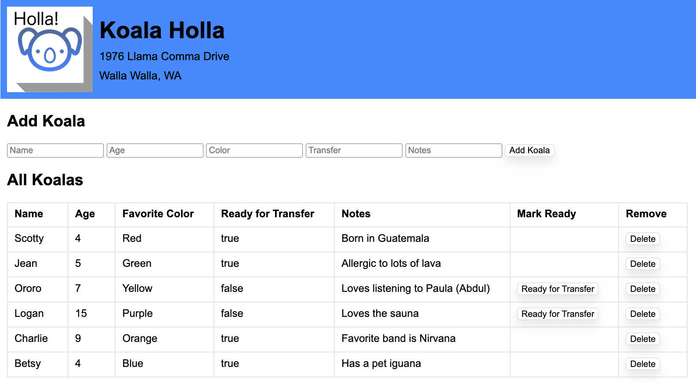

Koalas Deserve Better!

===========

Our client, Koala Holla (1976 Llama Comma Drive, Walla Walla WA) is a non-profit dedicated to the ethical transitioning of koalas from the outdoors (whereupon they may be rained) to urban areas where roofs exist. Your team has been hired to build a web app to handle their terrarium residents.

Technologies
------------
* Node
* Express
* SQL

Database Needed
------------
Current Koala Residents:

| id | name    | favorite_color | age | ready_to_transer | notes                            |
|----|---------|--------|-----|------------------|----------------------------------|
| 1  | Scotty  | Red      | 4   | Y                | Born in Guatemala                |
| 2  | Jean    | Green      | 5   | Y                | Allergic to lots of lava         |
| 3  | Ororo   | Yellow      | 7   | N                | Loves listening to Paula (Abdul) |
| 4  | K'Leaf   | Purple      | 15  | N                | Never refuses a treat.                  |
| 5  | Charlie | Orange      | 9   | Y                | Favorite band is Nirvana         |
| 6  | Betsy   | Blue      | 4   | Y                | Has a pet iguana                 |

### Features

Input Form created with the appropriate info. Saves to the koala in the database. 

Koala can be marked as ready for transfer. 
Each koala has a toggle-button in that reads 'Ready for Transfer' to update the database for that specific Koala. The 'Ready for Transfer' button only appears for Koalas that haven't yet been marked ready for transfer.

### EXTRA FEATURES

1. Ability to delete a specific Koala from the database.  
2. Confirmation dialog before deleting (research SweetAlert).
3. Ability to make koalas toggle between ready for transfer and NOT ready for transfer.
4. Add form validation, additional styling and a README.md.
5. Client side filtering with a text box
6. Ability to edit other information (Name, Age, Notes) for existing Koalas in the db.

### Wireframe
--------

